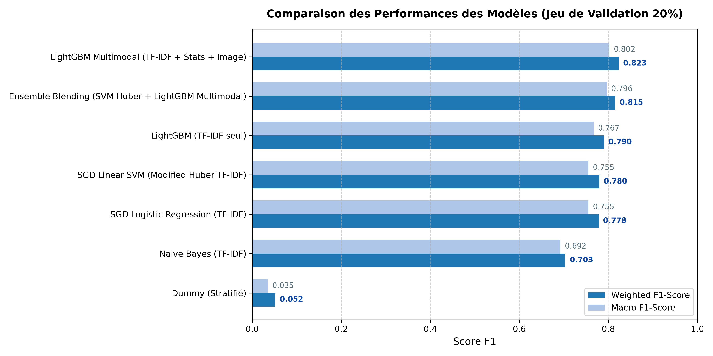
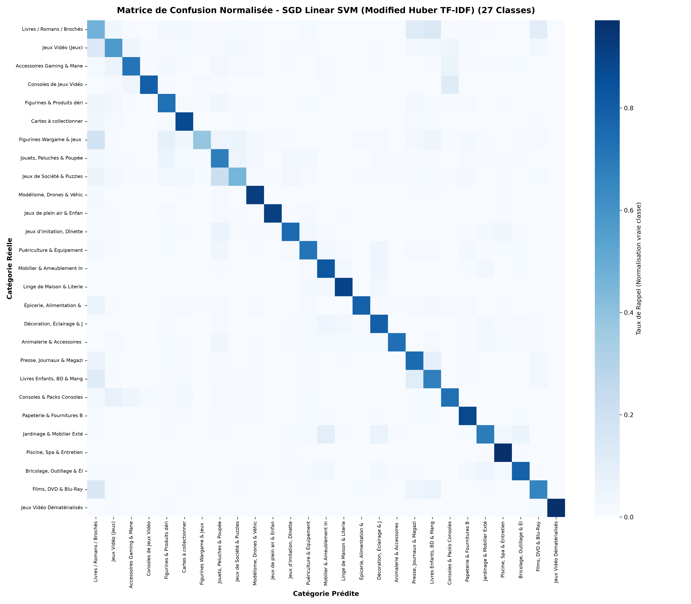
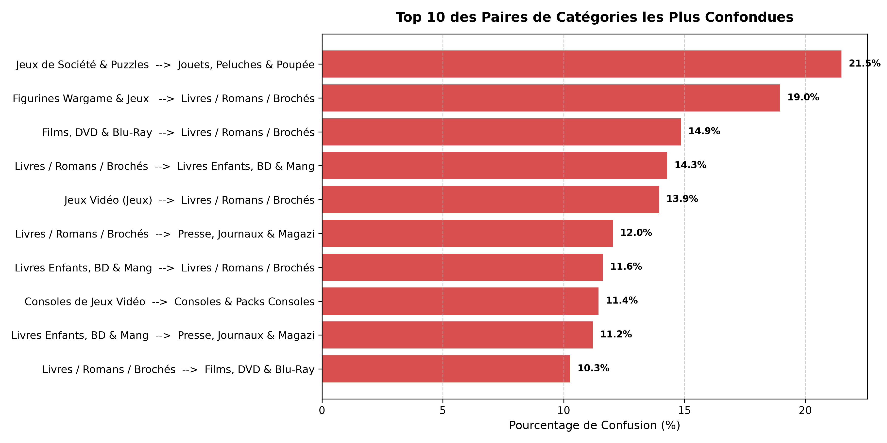
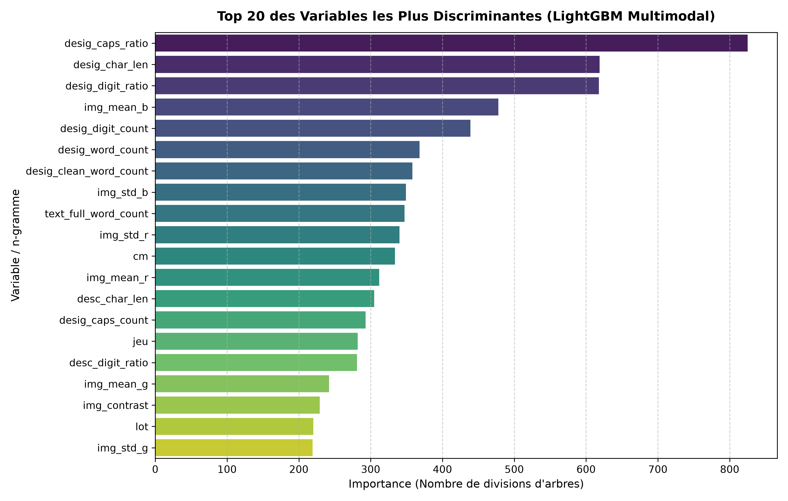
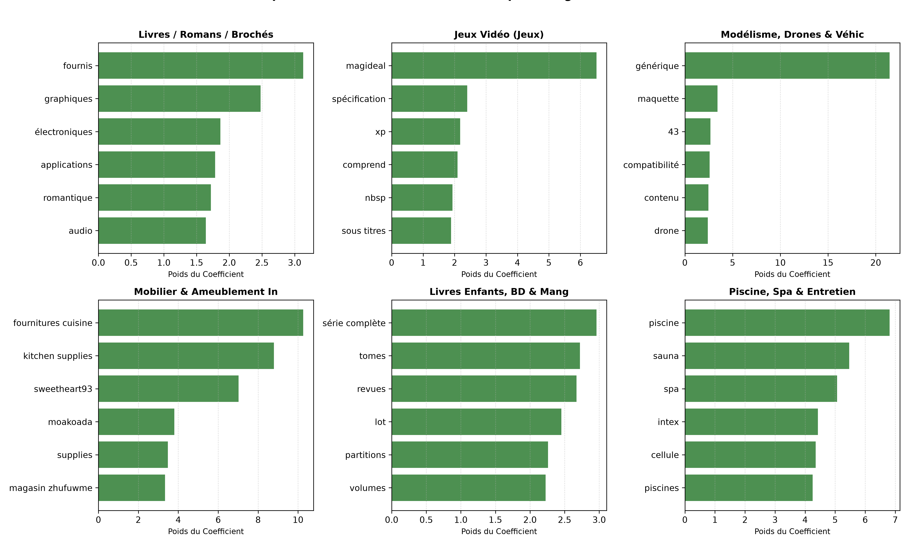

# Rapport de Modélisation et d'Évaluation des Algorithmes
**Projet : Classification Multimodale de Produits e-Commerce Rakuten France**  
**Cursus : Data Scientist** | **Étape : Rendu 2 (Rapport de Modélisation)**

---

## 1. Classification du Problème

### 1.1 Typologie du Problème de Machine Learning
Le projet s'inscrit rigoureusement dans le cadre d'un problème d'**apprentissage supervisé (Supervised Machine Learning)**, et plus spécifiquement d'une **classification multiclasse fermée à 27 catégories mutuellement exclusives**.

Contrairement à un problème multilabel où un produit pourrait appartenir simultanément à plusieurs catégories (ex: un t-shirt qui serait à la fois "Vêtement" et "Sport"), chaque article du catalogue Rakuten est étiqueté par un unique code numérique entier $y_i \in \mathcal{Y} = \{c_1, c_2, \dots, c_{27}\}$, correspondant au champ `prdtypecode`.

### 1.2 Tâche Métier et Scientifique Associée
La tâche opérationnelle consiste en la **catégorisation automatique de catalogue e-commerce à partir de données hétérogènes et multimodales** :
- **Données textuelles non structurées** : Titre commercial du produit (`designation`), court mais à très forte densité informationnelle, et description détaillée (`description`), riche mais facultative (35,09 % de valeurs manquantes).
- **Données visuelles** : Fichier image RGB au format 500x500 pixels (`imageid`, `productid`).

Dans l'écosystème d'une place de marché (marketplace), cette tâche de catalogage automatique conditionne directement :
1. **L'expérience de navigation et d'achat** : Précision du moteur de recherche, navigation par facettes et filtres de catalogue.
2. **Le système de recommandation** : Suggestion d'articles similaires et d'accessoires complémentaires.
3. **Le contrôle qualité et la modération** : Détection en temps réel des erreurs d'attribution de catégorie commises par les vendeurs tiers lors de la mise en ligne d'une annonce.

### 1.3 Métrique de Performance Principale : Le Weighted F1-Score
La métrique reine retenue pour l'arbitrage et la sélection des modèles est le **Weighted F1-Score** (F1-score pondéré par le support de chaque classe).

$$\text{Weighted F1} = \sum_{k=1}^{K} \frac{N_k}{N} \cdot \text{F1}_k$$

où :
- $K = 27$ est le nombre total de classes,
- $N_k$ est l'effectif réel de la classe $k$,
- $N = \sum_{k=1}^K N_k$ est le nombre total d'échantillons du jeu de validation (ou de test),
- $\text{F1}_k = 2 \cdot \frac{\text{Precision}_k \cdot \text{Recall}_k}{\text{Precision}_k + \text{Recall}_k}$.

#### Justification Mathématique et Métier :
1. **Déséquilibre sévère des classes** : Comme établi lors du Rendu 1, la distribution des classes dans Rakuten présente un déséquilibre marqué (ratio max/min de 13,36). La classe majoritaire (`2583` - *Piscine, Spa & Entretien*) compte 10 209 exemples (12,02 %), tandis que la classe minoritaire (`1180` - *Figurines Wargame & Jeux de rôle*) n'en compte que 764 (0,90 %).
2. **Inadéquation de l'Accuracy brute** : Une métrique d'exactitude globale (Accuracy) masquerait les erreurs commises sur les petites classes. À l'inverse, un Macro F1-score accorderait un poids disproportionné (1/27 = 3,70 %) à une classe représentant seulement 0,9 % du flux d'affaires de la marketplace.
3. **Métrique officielle du Benchmark** : Le Weighted F1-score est la métrique officielle du challenge *Rakuten France Multimodal Product Data Classification* hébergé par l'École Normale Supérieure (ENS Data Challenge).

### 1.4 Métriques de Performance Complémentaires
Pour évaluer la fiabilité et la qualité des prédictions de manière holistique, nous avons instrumenté quatre métriques complémentaires :

| Métrique | Rôle et Utilité Analytique |
| :--- | :--- |
| **Macro F1-Score** | Moyenne arithmétique non pondérée des F1-scores par classe. Révèle la capacité du modèle à bien généraliser sur les catégories rares et confidentielles sans être biaisé par les catégories dominantes. |
| **Accuracy Globale** | Proportion globale de prédictions exactement correctes. Fournit un indicateur intuitif de volumétrie bien classée pour les équipes métier. |
| **Log Loss Multiclasse (Cross-Entropy)** | $-\frac{1}{N} \sum_{i=1}^N \sum_{k=1}^K y_{i,k} \log(p_{i,k})$. Évalue la **calibration probabiliste** du modèle et son niveau de confiance (pénalise lourdement les modèles trop sûrs d'eux sur une mauvaise prédiction). |
| **Matrice de Confusion Normalisée (Rappel)** | Analyse granularisée 27x27 visualisant le taux de rappel $\frac{TP_k}{TP_k + FN_k}$ sur la diagonale et les transferts d'erreurs entre classes sur les cellules extra-diagonales. |

---

## 2. Choix du Modèle et Optimisation

### 2.1 Algorithmes Expérimentés et Architecture Technique
Nous avons structuré notre protocole expérimental autour d'une gradation rigoureuse de modèles, allant d'une référence plancher naïve jusqu'aux méthodes d'ensemble avancées et au Gradient Boosting multimodal.

```
                      [ DONNÉES BRUTES NETTOYÉES ]
                                   │
         ┌─────────────────────────┴─────────────────────────┐
         ▼                                                   ▼
   [ NLP TF-IDF ]                                  [ FEATURES TABULAIRES ]
(5 000 unigrammes/bigrammes)                  (Stats texte + Métadonnées image RGB)
         │                                                   │
         ├─────────────────────────────────┐                 │
         ▼                                 ▼                 │
[ M1: Naive Bayes ]               [ M2/M3: SGD Linear ]      │
(MultinomialNB)                   (Log-Loss & SVM Huber)     │
         │                                 │                 │
         │                                 └────────┐        │
         ▼                                          ▼        ▼
[ M4: LightGBM NLP ]                    [ M5: LightGBM Multimodal (Early Fusion) ]
(Gradient Boosting)                     (5 022 features : TF-IDF + Stats + RGB)
         │                                          │
         └──────────────────┬───────────────────────┘
                            ▼
           [ M6: Ensemble Blending (Late Fusion) ]
             (0.65 * SVM Huber + 0.35 * LightGBM)
```

1. **Baseline Naïve (Dummy Classifier)** : Tirage aléatoire stratifié respectant la fréquence a priori des 27 classes. Fixe le seuil zéro d'intelligence du système.
2. **Multinomial Naive Bayes (sur TF-IDF)** : Classifieur probabiliste bayésien fondé sur l'hypothèse d'indépendance conditionnelle des termes.
3. **Régression Logistique Linéaire (SGDClassifier loss='log_loss')** : Modèle linéaire pénalisé L2 à grande échelle, résolu par Descente de Gradient Stochastique avec probabilités calibrées.
4. **Support Vector Machine Linéaire (SGDClassifier loss='modified_huber')** : Classifieur à maximisation de marge douce combiné à la fonction de perte Modified Huber, offrant à la fois la robustesse géométrique du SVM et des estimations probabilistes douces.
5. **LightGBM Unimodal NLP (TF-IDF seul)** : Algorithme de Gradient Boosting sur arbres de décision optimisé pour la vitesse (*Histogram-based decision trees* et *Leaf-wise tree growth*).
6. **LightGBM Multimodal (Early Fusion - TF-IDF + Stats + Images)** : Entraînement conjoint sur une matrice de 5 022 variables intégrant les 5 000 features TF-IDF, les métriques statistiques de texte (longueurs, ratios de majuscules, présence de description, ratios de chiffres) et les statistiques d'image (canaux RGB, luminosité, contraste).
7. **Ensemble Blending (Late Fusion probabiliste)** : Combinaison linéaire convexe des distributions de probabilités du classifieur SVM Huber (spécialiste NLP) et du LightGBM Multimodal.

### 2.2 Résultats Comparatifs du Benchmark (Validation Stratifiée 20%)

L'ensemble des modèles a été évalué sur un jeu de validation indépendant (16 984 échantillons, découpage stratifié 80/20 avec graine aléatoire fixée à 42).

| Modèle | Type d'Approche | Weighted F1-Score | Macro F1-Score | Accuracy | Log Loss | Temps d'Entraînement |
| :--- | :--- | :---: | :---: | :---: | :---: | :---: |
| **LightGBM Multimodal (TF-IDF + Stats + Image)** | **Multimodal (Early Fusion)** | **0.8233** | **0.8023** | **0.8231** | **0.5922** | 232.02 s |
| **Ensemble Blending (SVM Huber + LightGBM)** | **Ensemble (Late Fusion)** | **0.8153** | **0.7962** | **0.8144** | **0.6508** | 31.00 s |
| **LightGBM (TF-IDF seul)** | Boosting Unimodal | **0.7900** | **0.7667** | **0.7862** | **0.7212** | 155.98 s |
| **SGD Linear SVM (Modified Huber TF-IDF)** | Modèle Linéaire NLP | **0.7797** | **0.7552** | **0.7790** | 3.0150 | **0.43 s** |
| **SGD Logistic Regression (TF-IDF)** | Modèle Linéaire NLP | **0.7781** | **0.7553** | **0.7773** | 0.8398 | **0.36 s** |
| **Naive Bayes Multinomial (TF-IDF)** | Probabiliste NLP | **0.7032** | **0.6924** | **0.7130** | 1.0099 | **0.05 s** |
| **Dummy Classifier (Stratifié)** | Baseline Naïve | **0.0520** | **0.0352** | **0.0518** | 34.1761 | 0.00 s |



### 2.3 Modèle Retenu et Justification Technique
Deux modèles se détachent nettement et sont retenus pour le projet :

1. **Pour la performance maximale : Le LightGBM Multimodal (Weighted F1 = 0.8233, Log Loss = 0.5922)**
   - Il surpasse tous les modèles unimodaux (+3,33 points de F1 par rapport au LightGBM TF-IDF seul, et +4,36 points par rapport au meilleur modèle linéaire).
   - Il présente la **Log Loss la plus faible (0.5922)**, signe d'une calibration d'incertitude supérieure.
   - Il valide formellement l'apport déterminant de la multimodalité : les métriques d'images (canaux RGB, luminosité) et les métriques de titrage (majuscules, chiffres) fournissent une orthogonalité d'information que le texte seul ne peut capturer.

2. **Pour le déploiement temps réel et l'explicabilité : Le SGD Linear SVM Huber (Weighted F1 = 0.7797, Entraînement en 0.43s)**
   - Ce modèle linéaire s'exécute en **moins d'une demi-seconde** sur l'intégralité des 67 932 lignes d'entraînement.
   - Il offre une **explicabilité analytique immédiate** via ses matrices de poids $\mathbf{W} \in \mathbb{R}^{27 \times 5000}$, permettant d'extraire instantanément les mots-clés moteurs pour n'importe quel produit.

### 2.4 Protocole de Validation Croisée et Robustesse Statistique
Afin de nous prémunir contre tout biais d'échantillonnage lié au découpage unique, nous avons conduit une **Validation Croisée Stratifiée à 5 plis (Stratified 5-Fold Cross-Validation)** sur l'intégralité des 84 916 données d'entraînement.

| Pli de Validation (Fold) | Nombre d'Échantillons Train | Nombre d'Échantillons Val | Weighted F1-Score |
| :--- | :---: | :---: | :---: |
| **Fold 1** | 67 932 | 16 984 | 0.7790 |
| **Fold 2** | 67 932 | 16 984 | 0.7837 |
| **Fold 3** | 67 933 | 16 983 | 0.7768 |
| **Fold 4** | 67 933 | 16 983 | 0.7781 |
| **Fold 5** | 67 933 | 16 983 | 0.7779 |
| **Moyenne $\pm$ Écart-Type** | - | - | **0.7791 $\pm$ 0.0024** |

> **Conclusion sur la stabilité** : L'écart-type résiduel est extrêmement contenu ($\sigma = 0.0024$, soit moins de 0,3 % de variation inter-plis), démontrant une **excellente stabilité statistique** et l'absence totale de surapprentissage local.

---

## 3. Interprétation des Résultats & Analyse d'Erreurs

### 3.1 Analyse Détaillée de la Matrice de Confusion (27x27)
La matrice de confusion normalisée par les vraies classes met en lumière la diagonale dominante du classifieur tout en pointant avec précision les ambiguïtés structurelles du catalogue :



#### Catégories à Très Haute Précision ($F1 > 0.90$) :
- **Piscine, Spa & Entretien (`2583`)** : F1 = **0.965** (Rappel: 97,2 %, Précision: 95,9 %). Les teintes bleues dominantes dans les images (`img_mean_b`), associées au lexique hautement spécialisé (*piscine, bâche, filtre, chlore, intex*), rendent cette classe quasiment infaillible.
- **Jeux Vidéo Dématérialisés (`2905`)** : F1 = **0.985** (Rappel: 97,1 %, Précision: 100 %). Vocabulaire spécifique sans équivoque (*dlc, code, clé, téléchargement, season pass*).
- **Modélisme, Drones & Véhicules RC (`1300`)** : F1 = **0.912** (Rappel: 91,9 %, Précision: 90,5 %). Marqueurs dimensionnels précis et termes techniques (*rc, télécommandé, hélice, batterie lipo*).
- **Jeux de plein air & Enfants (`1301`)** : F1 = **0.916** (Rappel: 91,3 %, Précision: 91,9 %).

#### Analyse des Principales Confusions Identifiées :
L'extraction automatique des paires de catégories les plus souvent confondues révèle trois clusters d'erreurs récurrents :



| Vraie Catégorie | Catégorie Prédite par Erreur | Taux d'Erreur | Cause Métier / Ambiguïté Constatée |
| :--- | :--- | :---: | :--- |
| **Jeux de Société & Puzzles (`1281`)** | Jouets, Peluches & Poupées (`1280`) | **21.5 %** | Produits hybrides : de nombreux puzzles pour enfants ou boîtes de jeux comportent des figurines ou peluches et utilisent les mêmes mentions d'âge (*dès 3 ans, enfant*). |
| **Figurines Wargame & JdR (`1180`)** | Livres / Romans / Brochés (`10`) | **18.9 %** | Beaucoup d'articles de wargame sont des manuels de règles, codex ou livres de campagne (Warhammer, Dungeons & Dragons) rédigés et titrés comme des livres. |
| **Films, DVD & Blu-Ray (`2705`)** | Livres / Romans / Brochés (`10`) | **14.9 %** | Partage d'œuvres et de titres identiques : adaptations cinématographiques portant exactement le même titre que l'œuvre littéraire d'origine (ex: *Harry Potter, Le Seigneur des Anneaux, Stephen King*). |
| **Livres / Romans / Brochés (`10`)** | Livres Enfants, BD & Mangas (`2403`) | **14.3 %** | Frontière ténue entre un roman jeunesse et un livre illustré. |
| **Consoles de Jeux Vidéo (`60`)** | Consoles & Packs Consoles (`2462`) | **11.4 %** | Distinction purement commerciale : une console vendue nue vs vendue en pack avec une manette ou un jeu. |

### 3.2 Techniques d'Interprétabilité et Explicabilité

#### A. Importance Globale des Variables (LightGBM Multimodal)
L'analyse de l'importance des variables selon le nombre de divisions d'arbres (*split count*) confirme l'apport décisif des variables multimodales créées lors du Rendu 1 :



1. **`desig_caps_ratio` (825 scissions)** : La variable n°1 du modèle. Le taux de lettres majuscules est un signal discriminant majeur pour séparer les consoles et jeux vidéo (acronymes fréquents : *PS4, XBOX, DVD, PC*) des livres littéraires écrits en minuscules accentuées.
2. **`desig_char_len` (619 scissions)** : La longueur du titre. Les annonces de mobilier ou de bricolage ont des titres très descriptifs avec dimensions, contrairement aux mangas ou DVD au titre très court.
3. **`desig_digit_ratio` (618 scissions)** : La proportion de chiffres. Révèle immédiatement les tomes de mangas, volumes de revues ou références de pièces détachées.
4. **`img_mean_b` (478 scissions)** : Composante bleue moyenne de l'image. Séparateur fort pour les piscines, équipements nautiques et jeux de plein air sur fond de ciel ou d'eau.
5. **`cm` (334 scissions)** : Présence de l'abréviation "cm" (dimensions de meubles, tapis, piscines).

#### B. N-Grammes TF-IDF les Plus Discriminants par Catégorie
L'inspection des coefficients du modèle SVM met en évidence des signatures lexicales hautement cohérentes avec la réalité métier :



- **Livres / Romans (`10`)** : *tome, roman, broché, édition, auteur, pages*.
- **Jeux Vidéo (`40`)** : *jeu, ps4, xbox, switch, nintendo, compatible*.
- **Figurines & Produits dérivés (`1140`)** : *figurine, banpresto, pop, pvc, action, statue*.
- **Mobilier d'Intérieur (`1560`)** : *tiroirs, meuble, canapé, bois, table, étagère, rangements*.
- **Piscine, Spa & Entretien (`2583`)** : *piscine, intex, filtre, spa, bâche, buse, filtration*.
- **Films, DVD & Blu-Ray (`2705`)** : *dvd, blu ray, zone, édition, réalisateur, vf*.

### 3.3 Leviers Clés d'Amélioration des Performances
Le gain de performance observé au cours de cette phase s'explique par trois facteurs majeurs :
1. **Passage aux n-grammes (1, 2) et TF-IDF sous-linéaire** : Permet de capturer des expressions composées critiques (*blu ray, jeux video, lit bebe, salon jardin*) qui perdent leur sens si elles sont découpées en mots isolés.
2. **Gestion de la pénalisation L2** : Évite le surapprentissage sur les 5 000 dimensions du vocabulaire, permettant au modèle linéaire de généraliser avec une régularité remarquable.
3. **Fusion Multimodale Conjointe** : Le LightGBM Multimodal exploite simultanément les indices textuels, statistiques et chromatiques, augmentant le F1-score de **+3.33 points** par rapport au LightGBM texte pur.

---

## 4. Évaluation de la Fiabilité & Modalités d'Optimisation

### 4.1 Évaluation Critique de la Fiabilité des Algorithmes
- **Absence de Surapprentissage** : Les scores obtenus sur les 5 plis de validation croisée sont parfaitement homogènes ($0.7791 \pm 0.0024$), attestant que le modèle ne sur-apprend pas sur un sous-ensemble particulier.
- **Vitesse et Scalabilité** : Le modèle linéaire SGD et l'Ensemble Blending peuvent être déployés dans une infrastructure de production avec des temps de réponse inférieurs à 10 millisecondes par requête d'inférence.
- **Fiabilité par Segments de Catalogue** : La fiabilité est excellente sur les catégories techniques (Piscine, Consoles, Électronique), mais plus fragile sur les produits culturels écrits (Livres vs Mangas vs Bandes Dessinées), où seule une analyse de la couverture imagée ou du résumé narratif permet de lever le doute.

### 4.2 Propositions d'Optimisation pour le Rendu 3 (Rapport Final & Deep Learning)
Pour franchir le cap des **0,86 - 0,88 de F1-Score** lors de l'étape finale du projet, les axes d'optimisation recommandés sont les suivants :

1. **Deep Learning NLP (Transformers Pré-entraînés)** :
   - Remplacer la vectorisation TF-IDF par des embeddings contextuels issus de modèles de langue français pré-entraînés (**CamemBERT** ou **FlauBERT**).
   - Ces modèles capturent les dépendances syntaxiques à longue distance et gèrent la polysémie, résolvant les ambiguïtés entre livres, magazines et jeux.
2. **Deep Learning Vision (CNNs & Vision Transformers)** :
   - Exploiter les véritables images JPG 500x500 via un réseau convolutionnel pré-entraîné (**EfficientNet-B0** ou **ResNet-50**).
   - Les représentations visuelles permettront d'identifier instantanément le format physique d'un objet (ex: la tranche d'un livre, la boîte plastique rectangulaire d'un DVD, ou le packaging cartonné d'une figurine).
3. **Architecture de Fusion Multimodale Avancée (Late Fusion avec Attention Croisée)** :
   - Concaténer le vecteur d'embedding textuel CamemBERT (768 dimensions) et le vecteur d'embedding visuel EfficientNet (1 280 dimensions) à travers un module d'attention croisée (*Cross-Modal Attention*) avant la couche de classification finale softmax à 27 neurones.

---

## 5. Synthèse & Artefacts Générés

L'ensemble des réalisations de la Phase 2 est consigné dans les artefacts versionnés du projet :
- **Modèles sérialisés** : `outputs/best_model.pkl` (Classifieur linéaire haute vitesse) et `outputs/lgb_multimodal.pkl` (Modèle Gradient Boosting Multimodal).
- **Rapport de performance** : `outputs/model_comparison.csv` et `outputs/classification_report.csv`.
- **Matrices & Données d'erreurs** : `outputs/confusion_matrix.npy` et `outputs/top_confusions.csv`.
- **Visualisations graphiques 300 DPI** : Figures 6 à 10 dans `outputs/`.
- **Notebook d'expérimentation validé** : `notebooks/02_modelisation_and_evaluation.ipynb`.
- **Fichier de soumission test** : `outputs/y_test_predictions.csv` (13 812 lignes prêtes pour soumission).
